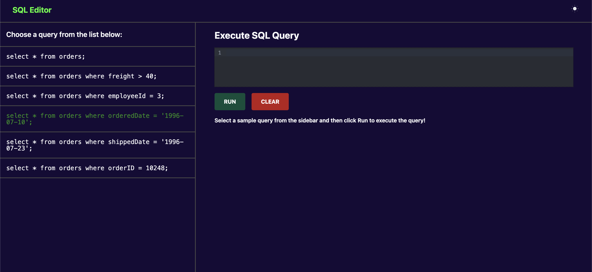
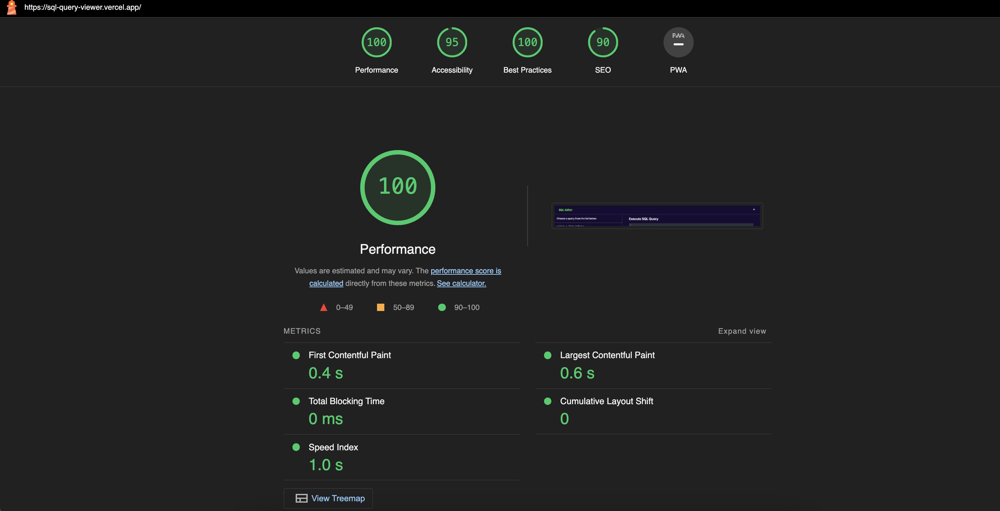
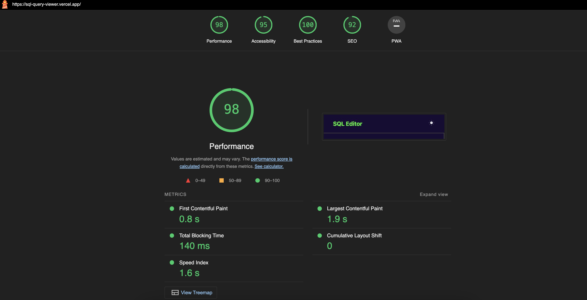

# SQL Editor Viewer

A SQL editor view where your users can query easily on a table using SQL, and see the results.

## Deployed on Vercel

[SQL Editor Viewer](https://sql-query-viewer.vercel.app/)

## Technologies Used:

1. Vue.js
2. Tailwindcss

## Features:

- Queries can be run and the editor can be cleared as well.
- Light and dark themes in the app, theme is persisted on page reloads.
- Tables can be exported to csv files.
- A list of predefined queries, clicking on a query pastes it in the editor which can then be run.

## Performance:

The app is pretty performant with **First Contentful Paint (FCP)** is just **0.4s**.

The lighthouse performance score is as shown below:

**Desktop Report**

**Mobie Report**

## Demo

https://www.loom.com/share/faa8675269e24a06b493827832d50f94?sid=41388307-4e97-4eeb-bcef-f83230fc158c
